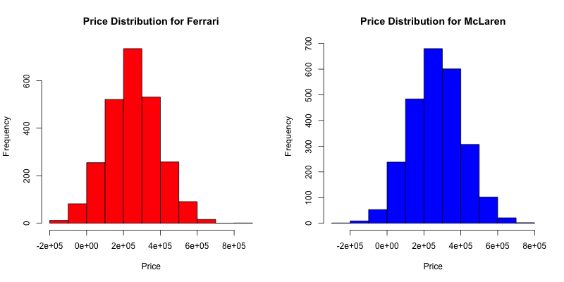
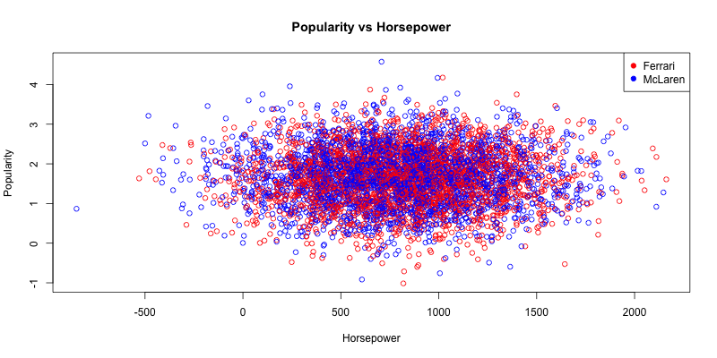

## Abstract

\begin{center}
Given a dataset containing information on horsepower, acceleration, price, fuel efficiency, CO2 emissions, mileage, popularity, and insurance costs for 5,000 sports cars, this project aims to analyze customer purchasing behaviors between two high-performance brands: Ferrari and McLaren. Specifically, the research question is: "What factors most influence a consumer’s decision to purchase a Ferrari versus a McLaren?" Through statistical analysis and simulation modeling, it was determined that horsepower, price, fuel efficiency, and brand popularity are significant factors in a customer's decision-making process. As per the buyer's preferences: customers who prioritize horsepower or fuel efficiency in a vehicle are likely to choose Ferrari, but customers prioritizing a high price or popularity of the vehicle would prefer a McLaren. This indicates that Ferrari is preferred by performance-driven consumers, whereas McLaren appeals to exclusivity-seeking buyers.
\end{center}

## Introduction

The 2025-2026 Formula One Season begins with its first Grand Prix in Melbourne, Australia on March 15th, 2025. The reigning champions of the Constructors Cup is the McLaren team, with one of their closest competitors being the historic brand of Ferrari. As a fan, I am eager to see if customer-purchasing behaviors between the brands' sports cars are similar to this trend seen in their racing.

Through this analysis, I hope to gain an understanding of what factors differentiate a Ferrari or a McLaren when for customers when purchasing either of these sports cars. These brands represent the upper echelon of sports vehicles and luxury brands (even being two of the top performing brands for the 2024-2025 Formula One season!); yet customers may weigh the various attributes, such as speed, prestige, cost, or environmental friendliness, differently in relation to the brand. The central question I am aiming to answer with the analysis is:

**What factors most influence a consumer’s decision to purchase a Ferrari versus a McLaren?**

By analyzing a dataset with horsepower, acceleration, price, fuel efficiency, CO2 emissions, mileage, popularity, and insurance cost statistics for 5,000 sports cars, the goal is to identify which one of these characteristics play the most significant role in shaping consumer preferences.

This analysis will benefit automakers of the Ferrari and McLaren brands; providing them insight on which attributes of their vehicle they should capitalize on when marketing a new sports car based on the response of customers in the sports car industry.

To address the research question, logistic regression based on data simulation is used to train a predictive model that classifies whether a given sports car buyer is more likely to choose a Ferrari or a McLaren based on their preferred attributes. This approach allows for both hypothesis testing and practical application in consumer analytics.

## Data

The dataset being used is "Elite Sports Cars in Data" (retrieved from: <https://www.kaggle.com/datasets/wlwwwlw/elite-sports-cars-in-data>). This dataset is synthetically generated, meaning it is artificially created data that mimics the characteristics and statistical properties of real-world data. The dataset is containing information on 5,000 sports cars with characteristics modeled to resemble real-world data, of which there are 27 variables. Of these variables, the following are of interest to the analysis: Brand, Horsepower, Acceleration_0_100, Fuel_Efficiency, Price, Mileage, Popularity, CO2_emissions, and Insurance_Cost.

I chose these specific variables to analyze because they each play a key role in a consumer's decision-making process when purchasing a sports car. My rational for these variables is as follows:

-   **Brand** – This is the central variable of interest, as the analysis will determine what factors influence a consumer's choice between the brands of Ferrari and McLaren.

-   **Horsepower** – This is a performance metric; directly impacts a car’s speed and acceleration, both of which are crucial selling points for sports cars.

-   **Acceleration** – This measures how quickly a car reaches high speeds, and important characteristic for sports cars.

-   **Fuel Efficiency** – Fuel economy would be important when making a purchase, as customers would prefer to have a high sustainability.

-   **Price** – This is seemingly one of the most significant factors in any purchasing decision.

-   **Mileage** – How much a car has been used may affect desirability and value of a car.

-   **Popularity** – This reflects consumer trends and brand loyalty, which influences purchasing behavior.

-   **CO2 Emissions** – Environmental impact may be a consideration for some buyers, particularly as regulations on emissions tighten. On the other hand, high CO2 emissions can be elusive for some customers, who feel as high CO2 emissions are because of a good engine of the car.

-   **Insurance Cost** – This varies based on the car’s risk profile, which influences a decision based on price.

The data cleaning process consisted of turning all character variables into factors or numeric in order to gain a overall understanding of the data, not just through the variables already numeric. Additionally, I removed all "NA" values in the dataset to simplify the data processing and reliability of the results.

Since the data is synthetically generated, a randomized simulation was created using the summary statistics of the data - in which the mean and standard deviation of variables that were interests for the analysis were procured and then simulated into normal distributions based on the Ferrari and McLaren observations. For synthetically generated data, it was important to use a simulated dataset to broaden the scope of the analysis and improve the final model's robustness.

In this simulation, the variables of horsepower, price, fuel efficiency, mileage, popularity, acceleration, and insurance cost were featured. The brand variable - which was previously containing various different brands was transposed into consist of only Ferrari or McLaren observations. When creating the data frame with this simulation, the brand variable was set to be binary - where McLaren was represented by "1" values, and Ferrari with "0".

## Visualization

Firstly, histograms were created to visualize the relationship between the distribution of the popularity variable based on the brand names. The McLaren histogram (seen below titled "Popularity Distribution for McLaren") dons a normal distribution, centered at around 1.5, which is true based on the previously found summary statistics that show a mean of 1.679012. Whereas, the Ferrari distribution (seen below titled "Popularity Distribution for Ferrari") is very slightly left skewed, with a similar mean of 1.632270. Therefore, it seems there a very similar distribution style between the popularity of Ferrari and McLaren; meaning it is similarly popular among the dataset, with McLaren being slightly more popular overall.

Additionally, the price distribution for both Ferrari and McLaren is also a visualization of interest. Though both the histograms are very similar (seen below titled "Price Distribution for Ferrari" and "Price Distribution for McLaren" respectively), it is clear that the McLaren graph is slightly right shifted, meaning that the McLaren prices are slightly higher. Both of these graphs are overall normally distributed, however, it is evident that the McLaren has a slight left-skew, pushing the distribution of price to be higher than Ferrari's. Based on the summary statistics, it is shown that the average price of a Ferrari is \$256136.90, and McLaren's is slightly higher with \$267438.80.

To better understand which factors are playing a role in customers' decision making in purchasing, the relationship between variables must also be tested to better understand their collinearity, and the impact on the overall research question. The scatterplot visualization of horsepower and popularity among both brand observations shows there is no correlation between these two variables (seen below titled "Popularity vs Horsepower"). Additionally, it is seen that there are no observable patterns among the Ferrari and McLaren observations as they are all dispersed seemingly randomly throughout the graph.

Before performing logistic regression, it is important to assertain the relationship between brand name and popularity. Since popularity is a categorical variable ranging from 0 to 4, a boxplot will be used to visualize the distribution of popularity across different brands instead of a scatterplot. The boxplot (seen below titled "Popularity vs. Brand Name") It seems brand name is playing a role in popularity, as the mean of the McLaren is higher than the mean of the Ferrari. This is evident in the summary statistics as well, and in the initial separated histograms made first to understand the popularity distributions among the brands.

## Analysis

Using the simulated dataset, consisting of 5000 observations and nine variables, logistic regression was used in order to understand correlations among the variables. From the logistic regression function between the variables and the Ferrari and McLaren brands, the following results were received:

| Variable Name   | P-Value  | Significance          | Coefficient |
|-----------------|----------|-----------------------|-------------|
| Horsepower      | 0.000405 | Highly significant    | -2.463e-04  |
| Price           | 0.000105 | Highly significant    | 7.868e-07   |
| Fuel Efficiency | 0.018877 | Significant (\< 0.05) | -2.262e-02  |
| Mileage         | 0.347580 | Not correlated        | 3.716e-07   |
| Popularity      | 0.009238 | Very Significant      | 1.023e-01   |
| Acceleration    | 0.148044 | Not correlated        | -2.817e-02  |
| Insurance Cost  | 0.095091 | Not correlated        | -1.113e-05  |
| CO2 Emissions   | 0.004740 | Very Significant      | 8.091e-04   |

Based on their p-values being less than 0.05, it can be concluded that the variables of horsepower, price, fuel efficiency, popularity, and CO2 emissions are significant as determining factors for customers' purchasing patterns. The variables of horsepower and price in particular have the lowest p-values, making the most significant variables in a customer's decision.

Here, the coefficients represent the log-probabilities of the outcome variable. Since when Brand_Binary variable being set to 1 represents McLaren, the following trend occurs:

**A positive coefficient means that as the predictor increases, the probability of choosing a McLaren increases. When there is a negative coefficient, the probability of choosing Ferrari increases.**

Taking this into consideration, horsepower's coefficient of -2.463e-04 indicates an increase in likelihood of a customer choosing a Ferrari based on horsepower, rather than McLaren. This suggests the Ferrari brand has cars with higher horsepower than McLaren - which is seen by the average values of the horsepower; Ferrari's being 822.2946 and McLaren of 792.0082.

The price variable has the overall highest correlation: making it the most important factor that customers take into consideration when purchasing a sports car. With it having a positive coefficient of 7.868e-07, it is clear that customers looking for an expensive car are likely to choose McLaren over Ferrari. This suggests McLarens have higher pricing than Ferrari: a trend seen by McLaren's average price of \$267438.8 - a drastic \$11301.90 higher than Ferrari's average at \$256136.90.

The fuel efficiency is the variable that has the highest p-value of the five correlated variables, making it the least important factor for a customer's decision. Nevertheless, its negative coefficient of -2.262e-02 indicates that customers looking for cars with high fuel efficiency are rather to choose Ferrari than McLaren. This is indicative of Ferrari's higher fuel efficiency compared to McLaren - with Ferrari having a mean of 10.087054 versus McLaren with a mean of 9.845885.

The popularity variable's coefficient is positive (1.023e-01), meaning that customers who are looking for a car that has high notoriety are more likely to choose McLaren compared to Ferrari - perpetuated from the notion that McLarens are more popular than Ferraris. The average popularity rating of a McLaren is 1.679012, which is higher than Ferrari's averafe rating of 1.632270.

Since the CO2 emissions variable has a positive coefficient of 8.091e-04, higher CO2 emissions increase the likeliness of a customer picking a McLaren rather than a Ferrari. The data implies that a customer looking for a car with high CO2 emissions are rather to pick McLaren than Ferrari; alluding to McLarens having higher CO2 emissions than Ferraris. McLaren has an average CO2 emission of 279.1955, which is higher than Ferrari's average of 272.4015.

Though this is a simulated dataset, the findings are in correlated to real-world patterns: proven by the claims being backed up by the averages from the original synthetic dataset. The relationships of the variables (such as price being the most important factor, or McLarens having more popularity) is indeed reflective of commonly observed consumer trends in the luxury sports car market.

## Conclusions

Based on the analysis, the following conclusions are formulated:

-   **If a customer values a high horsepower, they are more likely to choose Ferrari.**

-   **If a customer values a higher priced brand, they are more likely to choose McLaren.**

-   **If someone wants high fuel efficiency, they are more likely to choose Ferrari.**

-   **If someone values popularity, they are more likely to choose McLaren.**

-   **If someone wants a car with high CO2 emissions, they are more likely to choose McLaren.**

With this, it becomes clear that customers seeking a high performance vehicle will opt for a Ferrari rather than a McLaren; seen by its correlations in horsepower and fuel efficiency. Whereas, exclusivity-seeking customers are likely to purchase a McLaren between the two brands - seen by its correlated variables price, popularity, and CO2 emissions.

The most interesting finding was that the CO2 emissions variable is indeed a very significant factor in a customers' decision. However, this does intuitively make sense as CO2 emissions are closely linked to a car's performance characteristics. Sports cars with higher CO2 emissions are typically associated with more powerful engines, which may appeal to car enthusiasts seeking speed.

This analysis will benefit manufacturers of the Ferrari and McLaren brands, offering them insights into which features of their vehicles they should emphasize when promoting a new sports car based on customer reactions in the high-performance sports car market.

Some future steps I wish to pursue include broadening the scope of the analysis to include customer demographics like age, income, and geographic location could provide deeper insights into who is purchasing each brand. Additionally, analyzing their perception of different brands and if customers have any brand loyalties would be important to see how their purchasing decisions are reached.

Additionally, I would like to create a marketing strategy optimization plan where I can identify specific customer segments and see how marketing can be tailored to them based on key influencing factors - such as which advertisements should be targeting performance-driven versus status-drive customers.

Most importantly, I would continue to pursue analysis on this question, but would use a non-synthetic dataset to have more accurate results based on real-world data. As this is synthetic data, I used a simulation to model realistic trends and relationships. However, applying the same analysis to a real-world dataset would provide more reliable insights and validation.

Overall, I found correlations between the variables and the brand name through the use of a logistic regression model. This model revealed that customers tend to favor Ferrari for its performance, and McLaren for its exclusivity - and will make their purchasing decisions based on this. These insights, where a simulation was used due to the synthetic data, align with real-world trends and can help refine future marketing strategies.
